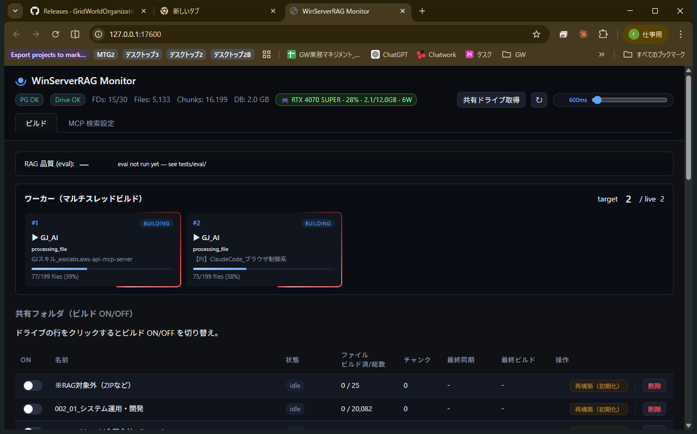
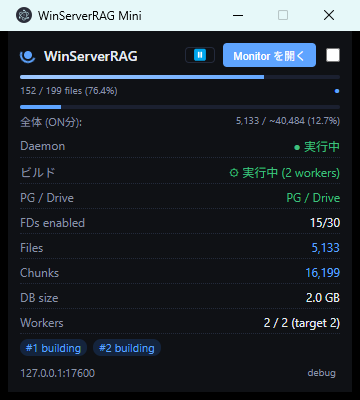

# WinServerRAG

[](#%E9%96%8B%E7%99%BA%E6%A1%88%E4%BB%B6%E3%81%AE%E3%81%94%E7%9B%B8%E8%AB%87)
[](.)
[](.)
[](.)

Windows 常駐の RAG（Retrieval-Augmented Generation）サーバー。
Google Drive の共有フォルダをセマンティック検索できるようにし、
Claude Cowork / Claude Desktop / 任意の MCP クライアントから **MCP (Model Context Protocol) 経由で遠隔検索** できます。

> ⚡ **実測性能**: warm search **840ms** (AWS API Gateway 経由、リランカー込み、RTX 4070 SUPER)
> 🔒 **セキュリティ**: Basic Auth + per-drive 分離スキーマ + PBKDF2-SHA256 + AWS IAM 最小権限
> 🔧 **運用**: 4 並列ワーカー、自動差分同期、ゾンビ GC、障害耐性

<p align="center">
  
</p>

<p align="center"><sub>Web Monitor (`http://127.0.0.1:17600/`)。GPU 利用率・worker カード・ドライブ一覧・MCP 検索設定タブを 1 画面で。FastAPI 上で動く SPA、Mini Monitor と同じ `/api/stats` を裏で叩く。</sub></p>

<p align="center">
  
</p>

<p align="center"><sub>常駐 Mini Monitor (always-on-top, 360x400)。Daemon 状態 / ビルド進捗 / FD 数 / DB サイズ / Worker pill を 250ms ポーリングでリアルタイム表示。Pause/Resume / 「Monitor を開く」 / Config 起動を Electron 内 IPC で操作。</sub></p>

---

## このリポジトリについて

これは **GridJapan** が実際に自社で運用している業務ツールのソースコードです。
社内 Google Drive の資料（数万件）を横断的に検索し、
Claude Cowork から遠隔で呼び出すために構築しました。

> 📖 **1 台の PC のバッチから GPU 駆動の AWS サーバーレスに変わるまでの進化記録**: [docs/EVOLUTION.md](./docs/EVOLUTION.md)

### 開発案件のご相談

このプロダクトのようなシステムを「自社にも作りたい」と感じた方へ。

GridJapan は **AI × 業務システム** の開発を請け負っています。
以下のようなテーマでご相談歓迎です：

- 社内ナレッジを **LLM / RAG** 経由で検索できる仕組み
- **Claude / OpenAI / 独自 LLM** の業務組み込み（MCP / Function Calling / Agent）
- **Windows サーバー** 上で動く AI システム（GPU 活用、常駐サービス化）
- **Google Workspace / Microsoft 365** など既存ツールとのネイティブ連携
- 既存の業務データから RAG データセットを構築するパイプライン

**お問い合わせ**: [tobisako@gridworld.co](mailto:tobisako@gridworld.co)
または GitHub Issue でお気軽にどうぞ。

---

## What is this?

WinServerRAG is a Windows-native RAG server we built and run internally at GridJapan.
It indexes Google Drive shared folders into pgvector, serves a Web monitor
and an Electron mini-monitor, and exposes search through the Model Context
Protocol so Claude Cowork on another machine can query it remotely through
an AWS serverless bridge.

The code in this branch is the real production copy we use day-to-day.

We are a small engineering shop based in Japan. If your team wants something
like this built for your business, reach out: **tobisako@gridworld.co**.

---

## できること

- Google Drive の共有フォルダ群を自動的に索引（構造認識チャンク + ベクトル）
- **ビルドは自動**: 有効化されたドライブを 4 ワーカー並列で常時追跡（変更検知は Changes API）
- **マルチスレッド** (デフォルト 4、`DAEMON_WORKER_THREADS` で調整)
- **Reranker**: BGE-m3 cross-encoder で Top-K 並び替え (`ENABLE_RERANKER=1`)
- **2 画面**: 管理者用「ビルド画面」 + 「MCP 検索設定画面」
- **Electron ミニモニター** (always-on-top、500ms 更新)
- **MCP サーバー** (Streamable HTTP + Basic Auth、クエリログ付き) → [MCP 接続ガイドはこちら](./MCP.md)
- **Eval Suite** (`tests/eval/`) — 品質の定量モニター
- **バックアップ** (`winserverrag-backup.exe`) — 日次 7 + 週次 4 世代

## アーキテクチャ

```
[Google Drive 共有フォルダ] → rag_daemon (N threads) → PostgreSQL + pgvector (per-FD schema)
                                      │
                                      ▼
                             control_api (FastAPI)
                              /            \
                             /              \
                   Web monitor              MCP server  ←── Claude Cowork (remote)
                   (localhost)              /mcp        (Basic Auth + Streamable HTTP)
                                            │
                                         Electron mini-monitor (desktop)
```

## クイックスタート

### 推奨: インストーラー (本番デプロイ向け、v1.2.0+)

1. PostgreSQL 17 + pgvector を Windows ネイティブで用意
2. [Releases](https://github.com/GridWorldOrganization/GridWorldRAG/releases) から
   `WinServerRAG-Setup-1.2.0.exe` をダウンロードして管理者で実行
3. `%ProgramData%\WinServerRAG\config\config.v2.env.example` を `config.v2.env` に
   コピーして編集 (DB 接続情報、OAuth credentials)
4. DB 初期化: `& "C:\Program Files\WinServerRAG\bin\winserverrag-dbinit\winserverrag-dbinit.exe"`
5. サービス起動: `Start-Service WinServerRAG-API, WinServerRAG-Daemon`
   (auto-start なので次回ブート以降は自動)
6. ブラウザで `http://127.0.0.1:17600/` → 管理画面
7. ミニモニタ: スタートメニューの「WinServerRAG Mini Monitor」
8. MCP 公開: [MCP.md](./MCP.md) 参照
9. バックアップ: `winserverrag-backup.exe` を手動実行 (Task Scheduler 禁止)

### 開発向け (リポジトリから直接)

1. Python 3.12+ と PostgreSQL 17 + pgvector を用意
2. `python -m venv .venv && .venv\Scripts\activate`
3. `pip install -r requirements.txt`
4. `config\config.v2.env.example` を `config\config.v2.env` にコピーして編集
5. DB 初期化: `python -m src.db_init`
6. API 起動 (Terminal 1): `python -m src.control_api`
7. デーモン起動 (Terminal 2): `python -m src.rag_daemon`
8. ブラウザで `http://127.0.0.1:17600/` → 管理画面
9. ミニモニタ: `cd desktop && npm start`
10. インストーラービルド: `pwsh installer\build.ps1` → `dist\WinServerRAG-Setup-*.exe`

## 廃案（設計書にあるが採用しない）

- **リモートモニター別アプリ** (旧 Phase 3 案): Web モニターをトンネルで公開 + Electron ミニモニターで十分。別プロセスの Tauri を作る価値無し
- **スレッド数の動的変更 UI**: 1 ユーザー運用では固定で十分。`DAEMON_WORKER_THREADS` で初期値のみ
- **per-user MCP 検索スコープ**: 複雑度に見合う価値無し。`fd_registry.search_enabled` でグローバル管理

## 画面

### ビルド画面 (`/` → ビルドタブ)

- ワーカー N スレッドの現在状態（どのドライブ・どのファイル・進捗バー）
- スレッド数スケーラ [−] [4] [+]、MIN 1 / MAX 10 でライブ変更
- 共有フォルダ一覧: 行クリックで **ビルド ON/OFF** トグル
- 各行に [再構築（初期化）] [削除] ボタン（destructive はダイアログ確認）

### MCP 検索設定画面 (`/` → MCP タブ)

- **MCP ログインユーザー** 管理
  - 初回 seed は `WINSERVERRAG_SEED_USERS="user1:pw1,user2:pw2"` の環境変数経由 (バンドルデフォルト無し)
  - UI から 追加・パスワード変更・削除 が可能
- **MCP 検索スコープ**: どの共有ドライブを遠隔検索の対象にするか行クリックで ON/OFF

### Electron ミニモニター

- 小窓、always-on-top、500ms 更新
- 稼働中はスピナー回転、ビルド進捗シマー、心拍ブリンク
- デーモン死亡 (2 分無心拍) で赤表示
- [Monitor を開く] ボタンで Web モニターをブラウザで開く
- Ctrl+Shift+D でデバッグオーバーレイ（API URL / last tick / 連続失敗 / raw stats / heartbeat 年齢）を開く

## サービス挙動仕様（pause / resume）

本サービスはバックグラウンドで RAG 構築を行う常駐プロセス。ミニモニタとは API 経由で双方向通信し、ユーザー操作で RAG ビルドの開始 / 停止を制御できる。

**ミニモニタ → サービス（制御）:**

- ミニモニタには **「開始」「停止」ボタン**（トグル式）を配置
- ボタン押下でサービスへ HTTP POST:
  - 「開始」 → `POST /api/daemon/resume` → サービスは新規タスクの取得を再開し RAG ビルドを進める
  - 「停止」 → `POST /api/daemon/pause` → サービスは新規タスクの取得を停止（in-flight タスクは完走）
- 停止状態は `daemon_config.paused` フラグとして DB に永続化、サービス再起動後も状態を保持

**サービス → ミニモニタ（状態確認）:**

- ミニモニタは `GET /api/stats`（既存の 250〜500ms ポーリング）で **RAG ビルドの開始状態 / 停止状態** を取得
- レスポンスに `paused: bool` フィールドを追加
- ミニモニタは画面上に現在の状態を表示:
  - **稼働中** — 緑インジケータ + 「停止」ボタン表示
  - **停止中** — 灰インジケータ + 「開始」ボタン表示
- ステータス文言・進捗バーも停止中は明示（"停止中（手動停止）"）

**API エンドポイント一覧:**

| メソッド | パス | 用途 |
|---|---|---|
| `GET` | `/api/daemon/state` | 現在の稼働 / 停止状態を取得（`{paused: bool, since: ISO8601}`） |
| `POST` | `/api/daemon/pause` | RAG ビルド停止（新規タスク取得を止める） |
| `POST` | `/api/daemon/resume` | RAG ビルド開始（新規タスク取得を再開） |
| `GET` | `/api/stats` | 統計 + `paused` フラグ（ミニモニタが定期取得） |

**設計上の注意:**

- 「停止」は **ワーク一時停止**であり、Windows サービス自体の停止ではない。FastAPI は稼働継続するためミニモニタの API 接続は維持される
- 進行中タスクは強制中断せず完走させる（DB 整合性保護）
- 停止状態でも Drive Changes API のトークンは進めない（次回開始時に取りこぼしなく再開）
- サービス本体（NSSM 登録の Windows サービス）の停止 / 再起動は OS の `services.msc` または `nssm stop` から行う（ミニモニタの管轄外）

## ミニモニタ ↔ Daemon 制御プロトコル (v1.3)

ミニモニタは **API のライフサイクルに依存せず** Daemon を直接監視・制御する。
API が停止していても Daemon が稼働中なら正しく "実行中" を表示する。
逆に Daemon 停止時は **管理者権限なしで起動** できる。

### 大原則 (boundaries)

- **インストール作業はインストーラーのみ**: `WinServerRAG-Setup-*.exe` を管理者で実行することで、API + Daemon の 2 サービスがペアで NSSM 登録される。ミニモニタはインストール (= `nssm install` / `sc create`) を **絶対に行わない**
- **日常運用は管理者権限不要**: 起動 (`sc start`) は SDDL 緩和済の専用ローカルグループ `WinServerRAG Operators` に限定付与され、UAC プロンプト無しで実行可能
- **Daemon が未インストール時は警告のみ**: ミニモニタの起動ボタンを押しても、`sc query` が rc=1060 を返す場合は「インストーラーを実行してください」のダイアログを出すだけで、何もインストールしない

### ミニモニタ → Windows SCM (sc query / sc start)

ミニモニタの Electron main プロセスから `%SystemRoot%\System32\sc.exe` を `child_process.execFile()` で直接呼ぶ。renderer は preload.js 経由で IPC アクセス。

| ポーリング | 対象 | 周期 | 目的 |
|---|---|---|---|
| `GET /api/stats` | API | 250ms | ビルド状態、pause フラグ、統計 |
| `sc query WinServerRAG-Daemon` | SCM | 5s | Daemon の SCM state (API 不通時もこれ) |

state 値は **数値で parse** (`STATE :  4  RUNNING` の `4`)。日本語 Windows でも壊れない。

| 数値 | 意味 | ミニモニタ表記 (灰=既知、黃=遷移中、赤=要注意) |
|---|---|---|
| `1` | STOPPED | ■ 停止中 (登録済) |
| `2` | START_PENDING | ⏳ 起動中... (黃 + spinner) |
| `3` | STOP_PENDING | ⏳ 停止中... (黃 + spinner) |
| `4` | RUNNING | ● 実行中 (緑) |
| `5` | CONTINUE_PENDING | ⏳ 遷移中... (黃) |
| `6` | PAUSE_PENDING | ⏳ 遷移中... (黃) |
| `7` | PAUSED | (rare、RUNNING 同等扱い) |
| rc=`1060` + venv 検出 | NOT_INSTALLED | 💻 dev mode (灰) |
| rc=`1060` + venv 不在 | NOT_INSTALLED | ✕ 未インストール (赤) |
| その他 | UNKNOWN | ? 状態取得失敗 (橙) |

### ボタン状態遷移表

ボタン押下で次の動作:

| Daemon 状態 | API paused | ボタン | 押下時の動作 |
|---|---|---|---|
| RUNNING | false | ⏸ | `POST /api/daemon/pause` |
| RUNNING | true | ▶ | `POST /api/daemon/resume` |
| STOPPED | — | ▶ | **`sc start WinServerRAG-Daemon`** (UAC 不要、SDDL 緩和) → poll RUNNING |
| START/STOP_PENDING | — | (disabled) | 押せない |
| NOT_INSTALLED + dev | — | 💻 | dialog: "venv で `python -m src.rag_daemon` を実行" + コピーボタン |
| NOT_INSTALLED + 本番 | — | ⊘ | dialog: "インストーラーを実行してください" + リンク |
| UNKNOWN | — | (disabled) | 押せない |

### `sc start` の error code 区別

`sc start` 戻り値で UI フィードバックを変える:

| exit code | 意味 | UI |
|---|---|---|
| `0` | 開始成功 (非同期、START_PENDING へ) | poll で RUNNING 確認 (30s タイムアウト) |
| `5` | アクセス拒否 | "起動失敗 — SDDL 設定を確認" |
| `1056` | 既に開始されている | 冪等 OK、success 扱い |
| `1060` | 未インストール | "未インストール (再表示)" |
| `1068` | 依存サービス起動失敗 | "API 起動失敗 — SCM ログ確認" |
| `1053` | 応答なし | "起動タイムアウト" |

### インストーラー側の責務 (v1.3)

`installer/install-services.ps1` (管理者権限要、Inno Setup `[Run]` から呼ばれる) で:

1. `WinServerRAG-API` + `WinServerRAG-Daemon` を `nssm install` (冪等: 既存検出+更新、blind install しない)
2. Daemon の `DependOnService = WinServerRAG-API`
3. **ローカルグループ `WinServerRAG Operators` を作成** (`net localgroup ... /add`、既存なら no-op)
4. インストーラー実行ユーザーをグループに追加
5. **両サービスの SDDL を `sc sdset` で書き換え**:
   ```
   (A;;LCRPLO;;;<SID-of-WinServerRAG-Operators>)
   ```
   付与: `SERVICE_QUERY_STATUS` + `SERVICE_START` のみ (SERVICE_STOP は **付与しない** — Microsoft ガイダンス: AU や広い範囲に START を渡すと実害)
6. uninstall 時に group + service を削除

### セキュリティ境界

- **インストール時に admin 1 回だけ**: NSSM 登録 + SDDL 設定 + group 作成
- **以降の起動操作は Operators グループメンバーのみ**: ドメイン全認証ユーザーや一般ユーザーは start 不可
- **API pause/resume は HTTP のみ**: API_BEARER_TOKEN 設定可、localhost-only がデフォルト
- **ミニモニタは Electron 通常権限 (UAC 不要)**: SDDL 緩和済サービスへの start のみ可能、install 系コマンドは一切実行しない

### UI 合成ルール (API down + Daemon up の独立表示)

ミニモニタの 2 行は **独立した data stream** から描画:

```
"Daemon"  ← sc query のみ依存。API 不通でも常に最新状態
"ビルド"  ← /api/stats のみ依存。API 不通時は "? (API 不通)" 表示
```

`showErr()` (API 接続失敗時) は **ビルド行 + PG/Drive 行 + 各統計のみクリア**。Daemon 行は触らない。

### v1.3 NOT in scope (将来候補)

- Path manifest (`%ProgramData%\WinServerRAG\config\paths.json`): `sc start` は exe path 不要のため不要
- Dev mode auto-spawn (Electron が `python -m src.rag_daemon` を spawn): v1.4 検討
- Mini-monitor から install 操作: 永久 NOT (security boundary)
- AWS bridge service の SCM 統合: v1.4

> 実装は v1.3 で予定。v1.2.0 時点では設計確定済み、コードはこれから。

## スキーマ (PostgreSQL)

- `public.fd_registry` : ドライブ登録・ビルド ON/OFF・検索スコープ ON/OFF
- `public.mcp_users`   : MCP ログインユーザー (PBKDF2-SHA256)
- `public.daemon_workers` : スレッドのライブ状態 (心拍)
- `public.daemon_config` : 動的設定 (worker_count 等)
- `fd_<drive_id>.documents` : ドライブごとの chunks + VECTOR(768)

## MCP (遠隔 RAG 検索)

**別 PC から Claude Cowork で検索したい場合** → [MCP.md](./MCP.md) に詳細手順があります。

提供される MCP ツール:

| tool | 引数 | 説明 |
|---|---|---|
| `list_drives` | — | 検索スコープのドライブ一覧 |
| `search` | `query, n_results=10, owner?` | セマンティック検索 |
| `lookup` | `url` | 特定 Drive URL の全文取得 |
| `stats` | — | インデックス統計 |

## 設定ファイル

優先順位: `config/config.v2.env` → `config/config.env` (legacy fallback)

| キー | 既定 | 説明 |
|---|---|---|
| `DAEMON_WORKER_THREADS` | `4` | 初期スレッド数 (UI で 1..10 変更可) |
| `DAEMON_ROTATE_INTERVAL_SEC` | `300` | ビルド sweep 間隔 |
| `API_HOST` / `API_PORT` | `127.0.0.1` / `17600` | 管理 API |
| `API_BEARER_TOKEN` | 空 | LAN 公開時は必須 (空だと localhost のみ) |
| `EMBEDDING_MODEL` | `paraphrase-multilingual-mpnet-base-v2` | 768 次元 |
| `GOOGLE_OAUTH_CLIENT_ID/SECRET` | — | Google OAuth 認証情報 |

## 運用 (Windows サービス化)

NSSM で常駐サービス化: [scripts/install_service.md](./scripts/install_service.md)

## 耐障害性

- `lockfile` で多重起動防止 (PID 生存確認、stale 検知)
- `pg_try_advisory_lock` でプロセス跨ぎの FD 排他制御
- デーモン `zombie_cleanup` で stale worker 行を 30 秒ごとに GC
- UI は worker heartbeat 120 秒超で stale 判定しアニメ停止
- stats エンドポイントは in-memory キャッシュで重書き込み中も即レス

## ライセンス

MIT（本リポジトリ上の内容）。Google API・pgvector 等の依存は各自のライセンスに従う。
