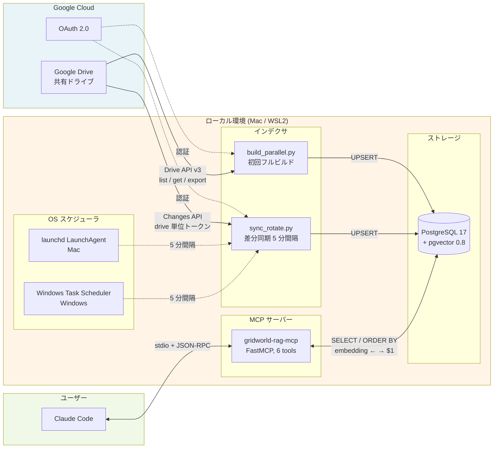
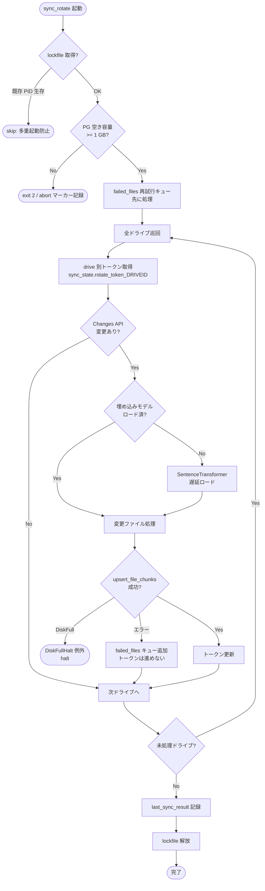

# Architecture

GridWorldRAG の全体アーキテクチャとデータフロー。実装詳細は [technical.md](./technical.md)、設計選定の理由は [adr/](./adr/) 参照。

## 2 つの実装系統

本リポジトリには Mac 版（GridWorldRAG）と Windows 版（WinServerRAG）の 2 系統が存在する。

| | GridWorldRAG（Mac 版） | WinServerRAG（Windows 版） |
|---|---|---|
| 対象 OS | macOS (Apple Silicon) | Windows 11 ネイティブ |
| バージョン | v0.2.1（安定） | v0.6.1（開発中） |
| インデクサ | `build_parallel.py` + `sync_rotate.py` | `rag_daemon.py`（統合常駐） |
| 定期実行 | launchd / Windows Task Scheduler (WSL) | NSSM Windows Service |
| DB スキーマ | 単一 `documents` テーブル | 共有フォルダ別 `fd_<drive_id>` スキーマ |
| モニター | `monitor.sh`（CLI） | FastAPI Web UI + Electron ミニモニタ |
| 埋め込み | CPU | GPU 対応 |
| MCP | stdio（ローカル Claude Code） | HTTP（Cowork 遠隔対応予定） |
| psycopg | psycopg2 (v2, source build) | psycopg[binary] (v3) |

以下は Mac 版（v0.2.1）のアーキテクチャ図。Windows 版は常駐 daemon 型に進化済み（[mac-resident-daemon.md](./mac-resident-daemon.md) の将来構想を先行実装）。

## システム全体像（Mac 版 v0.2.x）



## 3 フェーズ並列ビルド

`./run_build.sh` 実行時の処理フロー:

```mermaid
flowchart TD
    Start([run_build.sh]) --> Resume{filelist.pkl<br/>残存？}
    Resume -- Yes --> Prompt[Y/n プロンプト]
    Prompt -- Y --> Phase2
    Prompt -- N --> Phase1
    Resume -- No --> Phase1

    Phase1[Phase 1: ファイル一覧取得<br/>--fetch-only<br/>FETCH_THREADS=3 並列]
    Phase1 --> Probe[ドライブサイズプローブ<br/>pageSize=1000 で 1 ページ]
    Probe --> Sort[大きい順ソート<br/>長時間タスクを先に開始]
    Sort --> Fetch[各ドライブ全件取得]
    Fetch --> PickleFL[/tmp/gridworldrag_filelist.pkl]

    PickleFL --> Phase2[Phase 2: タスク分割<br/>--split-only]
    Phase2 --> Split{件数 ><br/>TASK_SPLIT_THRESHOLD?}
    Split -- Yes --> Parts[n 分割<br/>1/n 〜 n/n]
    Split -- No --> One[1 タスク<br/>1/1]
    Parts --> RR[ラウンドロビン順<br/>キュー投入]
    One --> RR
    RR --> PickleTD[/tmp/gridworldrag_taskdata.pkl]

    PickleTD --> Phase3[Phase 3: VectorDB 作成<br/>--work-only]
    Phase3 --> Workers[ワーカー N 並列起動<br/>WORKER_START_INTERVAL_SEC]
    Workers --> Loop[タスクキューから取得]
    Loop --> CheckExists{DB に既存?<br/>file_exists}
    CheckExists -- Yes --> Skip[resumeSkip]
    CheckExists -- No --> Extract[テキスト抽出]
    Extract --> Chunk[チャンク分割<br/>600 chars, 120 overlap]
    Chunk --> Embed[embedding 生成<br/>SentenceTransformer]
    Embed --> Upsert[DB UPSERT<br/>ON CONFLICT DO UPDATE]
    Skip --> Loop
    Upsert --> Loop
    Loop --> Done([完了 / Ctrl+C])

    Monitor[monitor.sh<br/>リアルタイム表示] -.進捗 JSON 読取.-> Phase3
```

## ローテーション型差分同期

`sync_rotate.py` の実行フロー（launchd / Task Scheduler から 5 分間隔）:



## MCP サーバー

FastMCP ベース、6 ツール提供:

```mermaid
flowchart LR
    subgraph CC[Claude Code]
        UI[チャット UI]
    end

    subgraph MCP[gridworld-rag-mcp/server.py]
        Lazy[埋め込みモデル<br/>遅延ロード]
        Search[search<br/>セマンティック検索]
        Lookup[lookup<br/>URL 直接取得]
        Stats[stats<br/>統計]
        Tree[folder_tree<br/>フォルダ再構築]
        Recent[recent_changes<br/>直近の差分]
        Hist[sync_history<br/>実行履歴]
    end

    subgraph PG[(PostgreSQL)]
        Docs[documents]
        SS[sync_state]
    end

    UI --stdio + JSON-RPC--> Search
    UI --> Lookup
    UI --> Stats
    UI --> Tree
    UI --> Recent
    UI --> Hist

    Search --encode クエリ--> Lazy
    Lazy --vector--> Search
    Search --ORDER BY embedding--> Docs
    Lookup --LIKE ... ESCAPE--> Docs
    Stats --GROUP BY--> Docs
    Tree --folder_path 再構築--> Docs
    Recent --last_sync_result--> SS
    Hist --sync_history JSON--> SS
```

## 耐障害性の設計

### build_parallel.py

| 障害 | 対策 |
|---|---|
| ワーカー致命的エラー | `_worker_main` 分離 + try/finally で `conn.close()` + `results_queue` 応答保証 |
| DB 接続断 | `insert_chunks` 失敗時に接続再作成、処理継続 |
| パイプブロック | 大きなタスクデータは Pickle 分離（`/tmp/gridworldrag_taskdata.pkl`） |
| Sheets API 429 | `multiprocessing.Semaphore(2)` で同時アクセス制限 |
| Ctrl+C | `daemon=True` + atexit + SIGTERM ハンドラ → terminate → join(10) → kill |
| /tmp 枯渇 | Phase 1 開始前に `BUILD_MIN_TMP_FREE_BYTES` 空き容量プリフライト → exit(2) |

### sync_rotate.py

| 障害 | 対策 |
|---|---|
| 多重起動 | `/tmp/gridworldrag_rotate.lock` + PID liveness probe + 20 分 stale fallback |
| PG ディスクフル | `_is_disk_full_error()` 検出 → `DiskFullHalt` 例外で halt、トークン据置 |
| PG 空き容量プリフライト | `shutil.disk_usage()` で `MIN_FREE_BYTES=1GB` チェック → abort マーカー |
| ファイル単体の失敗 | `failed_files` JSON キューに積み次回優先処理、トークン前進を安全化 |
| ログ肥大 | `RotatingFileHandler` 5MB × 3 世代（計 15MB 上限） |
| OAuth token refresh 失敗 | 指数バックオフ + 5xx / connection reset リトライ |
| NUL 文字（PDF） | `insert_chunks()` で `\x00` 除去（PG 拒否回避） |

### db.py

| 障害 | 対策 |
|---|---|
| カーソルリーク | 全関数で `try/finally` → `cur.close()` 保証 |
| 未コミットトランザクション | 書き込み系は例外時 `rollback()` |
| LIKE ワイルドカード誤マッチ | `_escape_like_literal()` + `ESCAPE '\'`（Drive file ID が `_` を含むため必須） |
| アトミック upsert | `upsert_file_chunks(file_id, chunks)` で delete + insert を単一トランザクション |
| SSL double-free | `psycopg2-binary` 廃止、`psycopg2` source build 版で libssl 統一 |

## コンポーネント責務

| コンポーネント | 責務 | プロセス寿命 |
|---|---|---|
| `build_parallel.py` | 初回フルビルド（3 フェーズ並列） | 一時（数十分〜数時間） |
| `sync_rotate.py` | 差分同期（ローテーション型） | 一時（数秒〜数分） |
| `gridworld-rag-mcp/server.py` | Claude Code からの検索 API | 一時（Claude Code 再起動で再生成） |
| `src/drive_client.py` | Google Drive API 呼出（認証・抽出・Changes） | ヘルパーライブラリ |
| `src/db.py` | PostgreSQL + pgvector 操作 | ヘルパーライブラリ |
| `src/indexer.py` | チャンク生成 / 権限抽出 | ヘルパーライブラリ |
| `src/monitor_render.py` | モニター表示レンダリング | ヘルパーライブラリ |
| `PostgreSQL + pgvector` | ベクトル + メタデータ永続層 | 常駐（OS サービス） |
| `monitor.sh` | ビルド中のリアルタイム可視化 | 一時（build_parallel と連動） |
| `launchd plist` / Windows Task | sync_rotate 定期実行 | OS サービス |

## 将来のアーキテクチャ方向性

v0.3.0 以降、現在のバッチ + cron 型から **Mac 常駐デーモン + GUI + MCP** 型への移行を計画している。詳細は [mac-resident-daemon.md](./mac-resident-daemon.md) 参照。

```mermaid
flowchart LR
    subgraph Current["v0.2.x (現行)"]
        C1[batch: build_parallel.py]
        C2[cron: sync_rotate.py]
        C3[MCP: gridworld-rag-mcp]
    end

    subgraph Future["v1.0.0 (目標)"]
        F1[daemon: gridworldrag-daemon<br/>常駐 asyncio]
        F2[GUI: menubar / full]
        F3[CLI: gridworldragctl]
        F4[MCP: IPC 経由で encode 委譲]
    end

    Current -.v0.3 → v1.0 段階移行.-> Future
```
